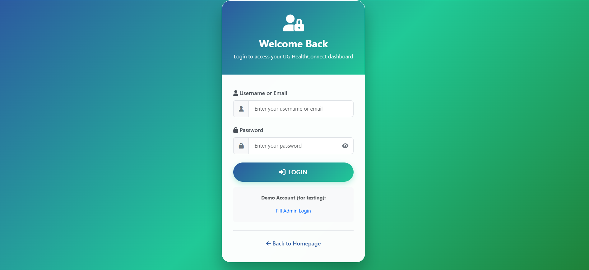
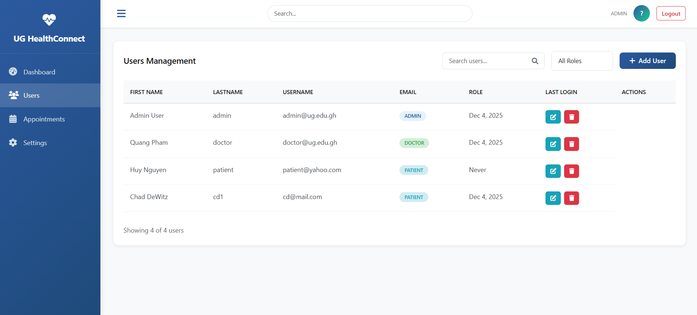
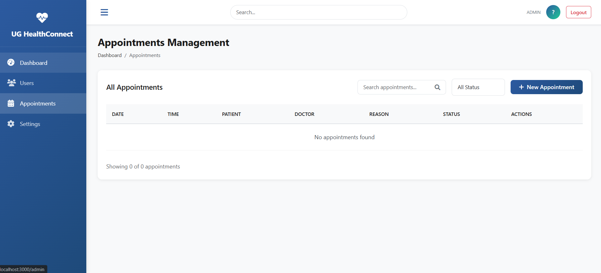
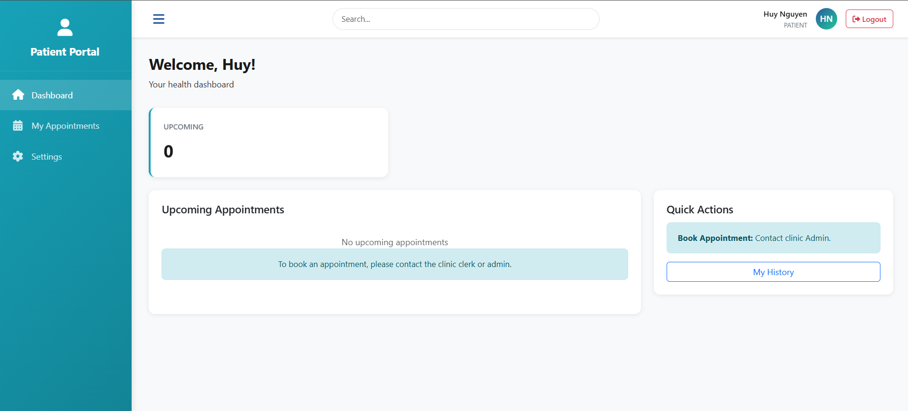
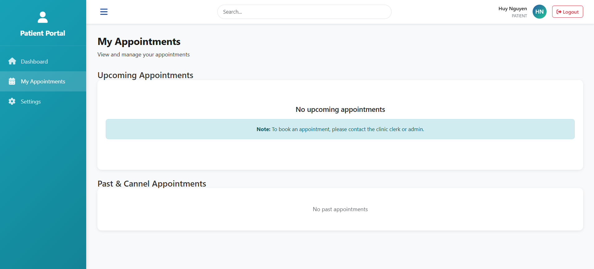
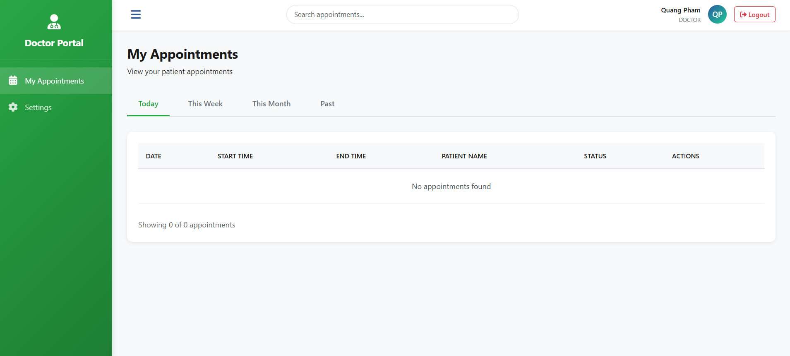

# UG HealthConnect — Patient Portal Web App

UG HealthConnect — CSC 423 Fall 2025 Team Project
- A Single-Page Web App for managing users and appointments in a primary-care medical clinic.
Users authenticate and are routed to dashboards based on one of three roles: Admin/Clerk, Patient, Doctor.

## Features

- Secure login with JWT
- Role-based dashboards
- Admin: full User & Appointment CRUD
- Patient: view & cancel appointments
- Doctor: view appointments (day / week / month)
- Password change for all roles
- SPA using React

## Tech Stack

- **Frontend** - React
- **Backend** - Node.js, Express
- **Database** - PostgreSQL (Supabase)
- **Auth** - JWT
- **Project Management**: Git/Github

## Project Structure

```
/frontend
/backend
/screenshots
    /admin
    /patient
    /doctor
    /auth
README.md
```

## Screenshots
### Authentication


### Admin Dashboard




### Patient Dashboard




### Doctor Dashboard


## Support

For issues or questions, contact the development team.

---

**Note:** This is a course project for CSC423 - Web Development Application.# WebApp
